# PKMHD Icons

An MKBHD **"Icons"**-style wallpaper generator using retro video game creature sprites.

Downloads sprites from a public sprite database, converts them into silhouettes, and arranges them in a staggered brick-pattern grid on a gradient background — just like the iconic MKBHD wallpaper, but with pocket monsters. Fully configurable colors, sizes, spacing, and gradients.


## Sample Gallery

Generated with `generate_samples.py` — 20 designs across desktop, ultrawide, and mobile resolutions.

### Desktop (16:9)

| Neon Pink (4K) | Ink on Paper (4K) | Citrus (4K) |
|---|---|---|
|  | 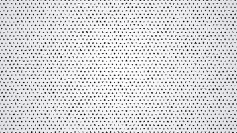 | 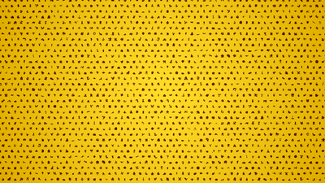 |

| Candy (1440p) | Stealth (1440p) | Valentine (1080p) | Matrix (1080p) |
|---|---|---|---|
| 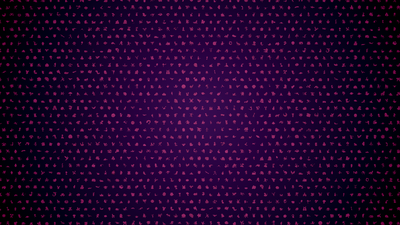 |  | 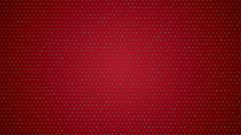 | 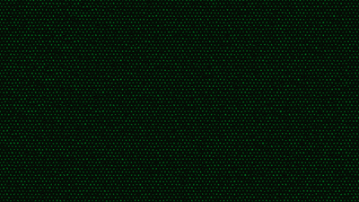 |

### Ultrawide (21:9)

| Royalty (UW 1440p) | Reef (UW 1440p) | Tron (UW 1080p) | Hot Orange (UW 4K) |
|---|---|---|---|
| 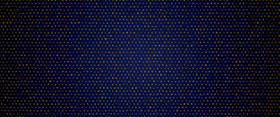 | 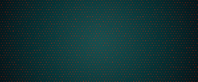 |  | 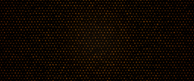 |

### Mobile (Portrait)

| Tropical (iPhone 15) | Neon Pink (iPhone 15) | Ultraviolet (iPM) | Ember Glow (iPM) |
|---|---|---|---|
| 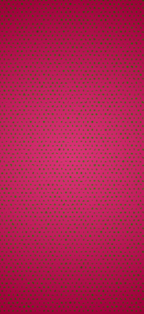 |  |  | 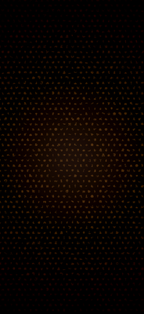 |

| Crimson (Galaxy S) | Parchment (Galaxy S) | Candy (Galaxy S) | Frozen (FHD) | Blueprint (FHD) |
|---|---|---|---|---|
| 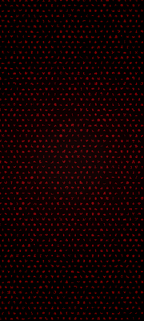 | 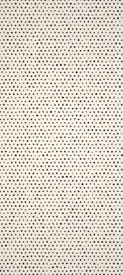 | 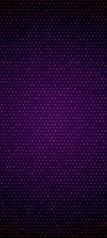 | 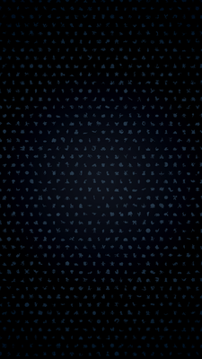 | 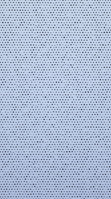 |

## Quick Start

```bash
# Install dependencies
pip install Pillow requests

# Generate a single wallpaper (edit pkmhd_icons.py to customize)
python pkmhd_icons.py

# Generate all 20 sample wallpapers across device sizes
python generate_samples.py
```

The wallpaper will be saved as `pkmhd_icons_wallpaper.png` in the same directory.

Sprites are cached locally in `sprite_cache/` after the first run, so subsequent runs are much faster.

## Configuration

All options are at the top of `pkmhd_icons.py`. No command-line args needed — just edit and re-run.

### Output

| Variable | Default | Description |
|---|---|---|
| `WALLPAPER_WIDTH` | `3840` | Output width in pixels |
| `WALLPAPER_HEIGHT` | `2160` | Output height in pixels |

### Sprite Grid

| Variable | Default | Description |
|---|---|---|
| `ICON_SIZE` | `36` | Sprite size in pixels |
| `GRID_SPACING_X` | `64` | Horizontal spacing between sprite centers |
| `GRID_SPACING_Y` | `58` | Vertical spacing between sprite centers |
| `ROW_OFFSET` | `32` | Brick-pattern stagger offset for alternating rows |

### Sprite Appearance

| Variable | Default | Description |
|---|---|---|
| `ICON_BRIGHTNESS` | `52` | Silhouette brightness (0 = invisible, 255 = full) |
| `ICON_COLOR` | `(255, 255, 255)` | Silhouette tint as RGB tuple — try `(0, 255, 100)` for green! |

### Background Gradient

| Variable | Default | Description |
|---|---|---|
| `GRADIENT_TYPE` | `"radial"` | `"none"`, `"radial"`, `"linear"`, or `"diagonal"` |
| `GRADIENT_COLOR_CENTER` | `(38, 38, 42)` | Center/start color |
| `GRADIENT_COLOR_EDGE` | `(18, 18, 20)` | Edge/end color |
| `LINEAR_GRADIENT_ANGLE` | `90` | Degrees for linear gradient (0=left→right, 90=top→bottom) |

### Vignette

| Variable | Default | Description |
|---|---|---|
| `VIGNETTE_STRENGTH` | `0.15` | Edge darkening (0.0 = off, 1.0 = full black at corners) |

## Examples

**Default (dark charcoal, subtle gray sprites):**
```python
ICON_COLOR = (255, 255, 255)
GRADIENT_COLOR_CENTER = (38, 38, 42)
GRADIENT_COLOR_EDGE = (18, 18, 20)
```

**Green on pink:**
```python
ICON_COLOR = (0, 255, 100)
GRADIENT_COLOR_CENTER = (60, 20, 40)
GRADIENT_COLOR_EDGE = (30, 10, 20)
```

**Blue ice:**
```python
ICON_COLOR = (100, 180, 255)
GRADIENT_COLOR_CENTER = (15, 20, 35)
GRADIENT_COLOR_EDGE = (5, 8, 18)
```

## Requirements

- Python 3.8+
- [Pillow](https://pypi.org/project/Pillow/)
- [Requests](https://pypi.org/project/requests/)

## License

MIT
